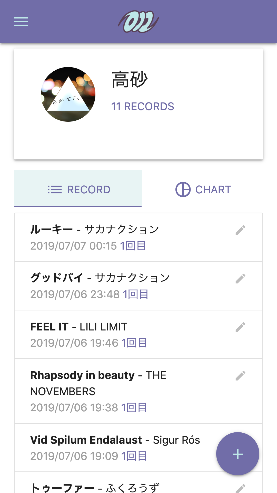
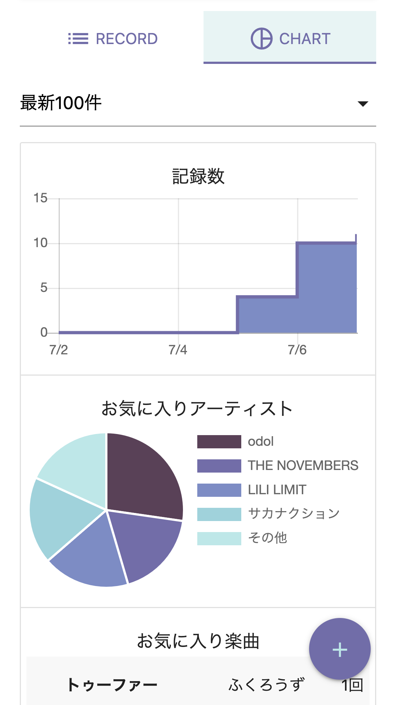

# makasha

## screenshots

 
## overview
makashaは音楽を記録するWebサービスです．単に聴いた音楽を記録するというより，特に印象に残ったもの(いわゆる「名曲」)だけを記録しておくことを軸としています． 
主な機能は3つで，  

- 名曲を記録する
- 記録したデータの可視化
- 名曲を発見する

音楽を聴き，名曲と出会うという一連の活動をもっと楽に楽しくすることが目標です．
